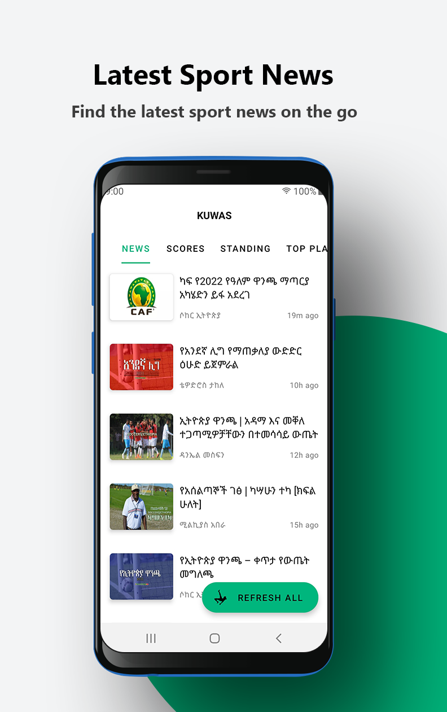

# Kuwas
`Android application that provides the latest news and detail about the Ethiopian premier league.`

#### Completely powered by [Soccer Ethiopia API](https://github.com/brookmg/Soccer-Ethiopia-API)

<p align="center">
<table border="1">
<tr><td></td>
<td></td>
<td></td>
<td></td>
<td></td></tr>
<tr>
<td><p align="center">Latest Sport News</p></td>
<td><p align="center">Designed For Reading</p></td>
<td><p align="center">Updated Team Scores</p></td>
<td><p align="center">Accurate Team Standing</p></td>
<td><p align="center">Current Best Players In League</p></td>
</tr>
</table></p>

## Features

* [X] AD-FREE
* [X] News
* [X] Weekly team scores
* [X] Team standing 
* [X] High performing players
* [ ] Team details
* [ ] Complete player detail
* [ ] Betting odds for teams 🤑
* [ ] Include other leagues

## Contribution
        
* Fork the repo
* Create a new branch `git checkout -b '$username_$feature'`
* Open a pull request 😁

## License
```
Copyright (C) 2019 Brook Mezgebu

Licensed under the Apache License, Version 2.0 (the "License");
you may not use this file except in compliance with the License.
You may obtain a copy of the License at

	http://www.apache.org/licenses/LICENSE-2.0

Unless required by applicable law or agreed to in writing, software
distributed under the License is distributed on an "AS IS" BASIS,
WITHOUT WARRANTIES OR CONDITIONS OF ANY KIND, either express or implied.
See the License for the specific language governing permissions and
limitations under the License.
```
